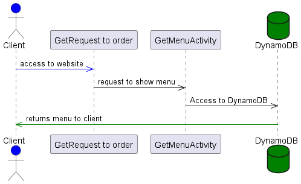
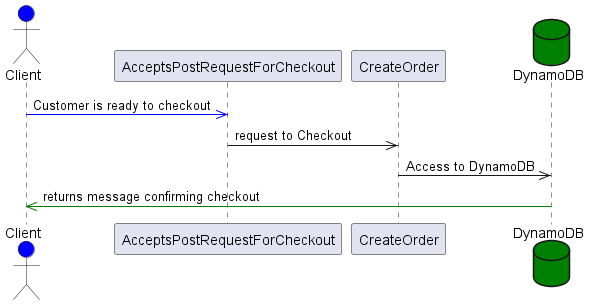
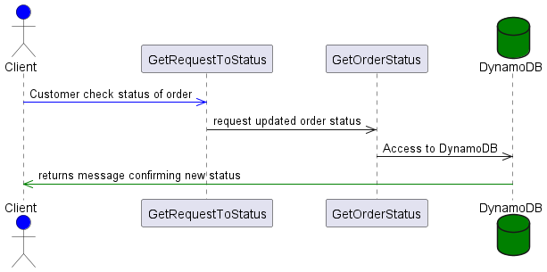
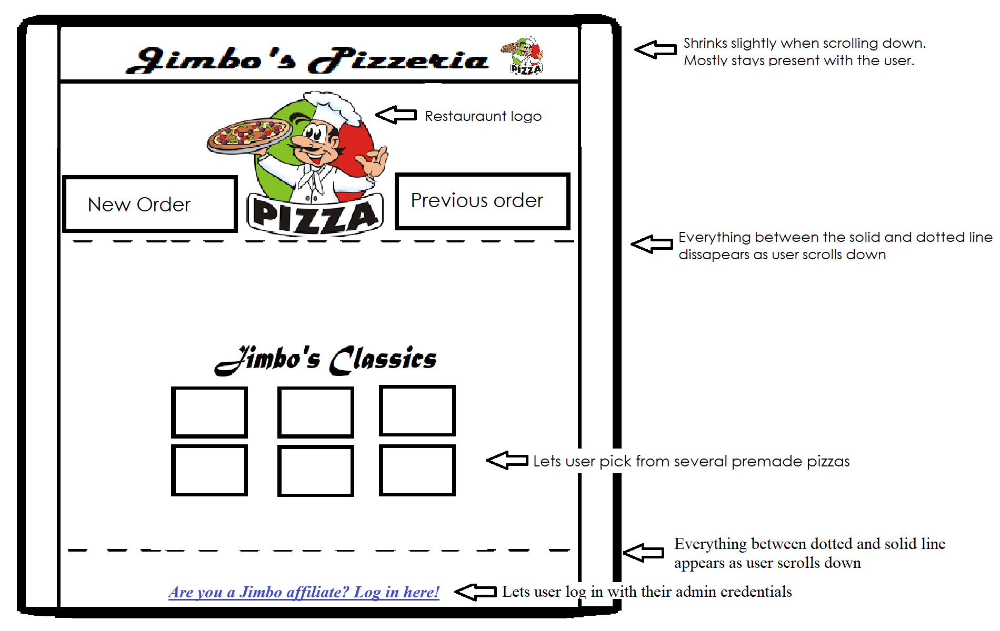
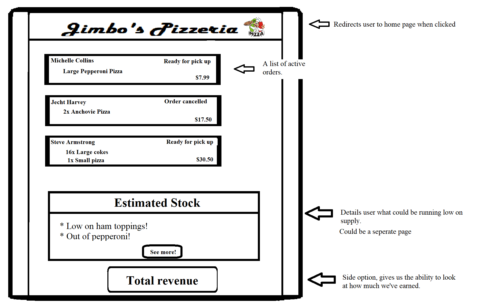
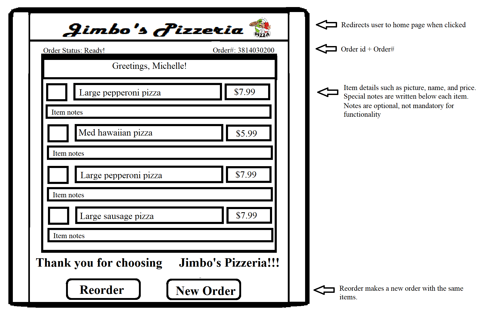

# Store Front Design Document


## Store Front Design

## 1. Problem Statement

Our team is creating the online presence of Jimbo's Pizzeria, a local restaurant.
With the increased popularity of ordering food via the app, the restaurant has decided to create its own online storefront.
This design document describes the online services available to the customer.
The service is designed to receive a fo~~od order from the customer, return an order confirmation, allow special requests to be added to the order, and provide the order's status to the customer.


## 2. Top Questions to Resolve in Review

How to get order status to the customer?

How to get the front and back end to communicate with each other?

How many database tables are needed?

Update menu functionality?


## 3. Use Cases

u1: I as a customer am hungry and would like to order food online.

u2: I as a customer want to view the status of my order.

u3: I as a customer would like to view previous orders.

u4: I as a customer would like to update my order.

u5: I as an owner would like to see the list of active orders.

u6: I as an owner would like to change order's status.

u7: I as an owner would like to see actual restaurant's stock.


## 4. Project Scope

4a Minimum:

    Display menu items on the website from the database (not a hardcode).
    Make and save orders to the database.
    Customer facing front end and Business facing front end.
    List of active orders for Business use.
    Calculate total price of order.

4b In Scope:

    Orders will have an updatable status from Business facing front end.
    Retrieve the order’s status with update time by order Id or customer’s phone number.
    Custom pizza from ingredients list.
    Restaurant stock tracking. Can be part of Business facing front end.
    Random pizza.
    Mark the item as unavailable on the website because of the lack of ingredients.
    Show selected items and total before confirming an order.
    Change the remaining count of ingredients in stock from the Business facing front-end (not manually in the database).
    User Log in.
    Add different sizes of pizza.
    Change order during checkout.

4c Out of Scope:

    Security.
    Communicate with customers through phone numbers.
    Credit card functionality.
    Delivery.


# 5. Proposed Architecture Overview

**Webpages with all features:**

**Start page** 

* with buttons “make an order”, “check order’s status”, and “for business use”.
* check the order’s status input field on the start page instead of a separate page.

**Client front-end part:**

* GetMenuActivity list with the ability to select items and enter counts. Button “Next”.
* A custom pizza page with ingredients to choose from.
* A checkout page with places to enter customer data and the button “Order”.
* Shows the total sum.
* Additional feature: show selected items.
* Additional feature: change order.
* Order succeeded page with a happy phrase, a new order id, total, and a list of ordered items (?).
* Use the Order status result page to show status immediately after the order is placed.
* If an error occurs then an unhappy phrase.
* Check the order’s status page with two input fields (order id or phone number).
* Order status result page with the order’s status with update time.

**Business facing front-end:**

* List of active orders page with a button to mark order done.
* Additional feature: show all orders sorted by status.
* Restaurant stock page with information from the database.
* Additional feature: change the remaining count of ingredients in stock.


# 6. API

## 6.1. Public Models

```
// IngredientsModel

String name;
Integer quantity; // 1 per 1 pizza
```
```
// MenuModel

String itemId;
String name;
String description;
List<String> ingredients;
Double price;
```
```
// OrdersModel

String orderId;
String customerPhone;
List<String> items; // “pepperoni pizza”,  “pepperoni pizza”, “cheese pizza”
Double total;
String status;
Date orderDate;
Date lastUpdateDate;
```
### **Flow Chart** 


## 6.2. *Get GetMenuActivity Endpoint*
* Accepts GET request to `/order`
* Returns the MenuModel


## 6.3 *Create Order Endpoint*

* Accepts POST request to `/checkout`
* Accepts a list of items and customer information and returns order id and status.
* Phone number and customer’s name are required
* Phone number contains only numbers, spaces, 10 digits
* A list of items has at least 1 item.
* Throw an InvalidAttributeValueException if a bad input occurs.



## 6.4 *Get Active Orders Endpoint*

* Accepts GET request to `/owner`
* Returns the list of OrdersModel objects with status = “received” OR “in-process”



## 6.5 *Other Endpoints*
These endpoints will be added in the second part of the project:
* Get Order Status Endpoint
  * Accepts GET request to `/status`
  * Accepts an order id and returns status.
* Update Orders Status Endpoint
  * Accepts PUT request to `/owner/:orderId` 
  * Accepts data to update order including an order ID, and a new status. Returns an updated order.
* Get Stock Endpoint
  * Accepts GET request to `/owner/stock`
  * Returns the list of ingredients with amounts
* Update Stock Endpoint
  * Accepts PUT request to `/owner/stock/ingredientId` 
  * Accepts an ingredient id and new amount. Returns an updated pair ingredient and amount.

# 7. Tables

### 7.1 `Orders` Table
```
orderId 	// String - Primary
name 		// String
phone 	        // String
menuItems 	// StringArray (ID of menu item)
status 		// String
total           // Number
orderDate 	// String - Sort
updatedDate 	// String
```
Command to create Orders table:
```
aws cloudformation create-stack --region us-west-2 --stack-name storefront-orderstable --template-body file://configurations/OrdersTable.yaml --capabilities CAPABILITY_IAM
```
Command to update Orders table:
```
aws cloudformation update-stack --region us-west-2 --stack-name storefront-orderstable --template-body file://configurations/OrdersTable.yaml --capabilities CAPABILITY_IAM
```
### 7.2 `GetMenuActivity` Table
```
itemId 		// String - Primary
name 		// String - Sort
description 	// String
category 	// String
cost 		// Number
ingredients  // StringArray
```
Command to create GetMenuActivity table:
```
aws cloudformation create-stack --region us-west-2 --stack-name storefront-menutable --template-body file://configurations/MenuTable.yaml --capabilities CAPABILITY_IAM
```
Command to update GetMenuActivity table:
```
aws cloudformation update-stack --region us-west-2 --stack-name storefront-menutable --template-body file://configurations/MenuTable.yaml --capabilities CAPABILITY_IAM
```
### 7.3 `Ingredients` Table
```
itemId 		// String - Primary
name 		// String - Sort
description	// String
stock 		// Number
cost		// Number
```
Command to create Ingredients table:
```
aws cloudformation create-stack --region us-west-2 --stack-name storefront-ingredientstable --template-body file://configurations/IngredientsTable.yaml --capabilities CAPABILITY_IAM
```
Command to update Ingredients table:
```
aws cloudformation update-stack --region us-west-2 --stack-name storefront-ingredientstable --template-body file://configurations/IngredientsTable.yaml --capabilities CAPABILITY_IAM
```


# 8. Pages

# **Web Page Sketches**

## **Home Page**



## **Business Home**



## **GetMenuActivity**


## **Order Status**




